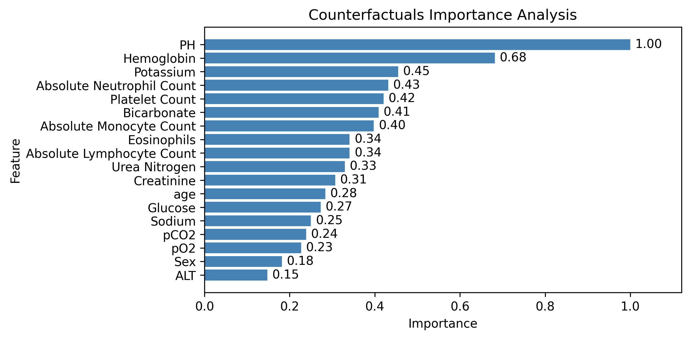
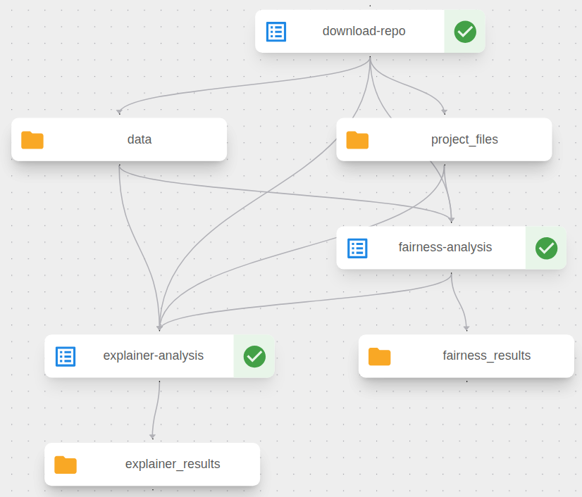

# realm_task_3_3_implementation_xai

## General Task Description

Components developed in Task 3.3 aim to implement agnostic XAI techniques on top of AI models that are used for various tasks such as classification or segmentation. We aim to implement two XAI techniques per Use Case - that would be selected dynamically from the Fuzzy system based on User's Input (sensitivity value coming from the RIANA dashboard), implement bias and fairness metrics (as agreed [here](https://maastrichtuniversity.sharepoint.com/:w:/r/sites/FSE-REALM/_layouts/15/Doc.aspx?sourcedoc=%7B9EDAE561-2787-42D1-BBB8-C9320C0B1F25%7D&file=Report%20on%20Bias%20and%20Fairness%20Metrics%20%5BTask%203.3%5D.docx&action=default&mobileredirect=true)) based on model outputs and extract outputs in a digestible manner (images, metrics, etc.).

This component, no matter the Use Case, expects as input:
- Sensitivity value (RIANA dashboard)
- Trained model (AI Orchestrator)
- Compatible dataset (AI Orchestrator)

This component, no matter the Use Case, returns as output:
- XAI methodology output (depending on the Use Case - image or json file)
- Fairness and Bias results (depending on the Use Case - nothing if we are talking for images or json file)


## COPD and ASTHMA inpatient risk stratification (ASCOPD) Analysis with Explainability (Use Case 4)

This project provides tools for analyzing and interpreting the predictions made by the ASCOPD model, which predicts inpatient risk for COPD and ASTHMA patients.  
It uses permutation feature importance and countefactual explanations to identify key features influencing the model's predictions.  
Additionally, it includes fairness/bias analysis to detect potential biases across demographic groups.


## Project Overview

The provided model takes an input clinical biomedical data and predicts as output the inpatient risk for COPD and ASTHMA patients. This project adds and explainability layer, allowing users to understand why the model makes certain predictions.

**IMPORTANT**: For this use case we are using a dockerized model for prediction. The model outputs are class labels (0, 1) and we do not have access to the model internals (weights, architecture, etc.) and probabilities. The model takes as input a CSV files with the tabular data and outputs a CSV file with the predictions. This is a limitation for some XAI techniques, like SHAP or LIME, as they require access to model internals or probabilities to generate explanations.

Key Components:
1. Input Data: The input data is a CSV file containing clinical biomedical data for COPD and ASTHMA patients. Each row represents a patient, and each column represents a feature. More details about the data can be found in the Data Structure section below.
2. Output Data: The output data is a CSV file containing the model's predictions for each patient. Each row represents a patient, and the columns include the predicted class labels (0 or 1). More details about the data can be found in the Data Structure section below.
3. Model: The model is provided in a Dokcer image. It is executed by passing the desired input and output file paths as command line arguments. More in Running the ASCOPD Model section below.
4. Fairness/Bias Analysis is performed using the [fairness_bias_analysis.py](./fairness_bias_analysis.py) script. This script can be executes independently and as part of the Kubeflow pipeline component.
5. Explainability Analysis is performed using the [explainer.py](./explainer.py) script. Again this script can be executes independently and as part of the Kubeflow pipeline component.
6. The results are visualized using the corresponding scripts. However, this is optional and is not integrated in the Kubeflow pipeline component.


## Getting Started

### Prerequisites
- Python 3.13 or higher
- Docker (for running the ASCOPD model)
- Required Python packages (installed via `pip install -r requirements.txt`, can be found in [requirements.txt](./requirements.txt))

### Data Structure

Three types of sample datasets are provided for experimentation. More specifically are provided tabular data with ARF (prediction of acute respiratory failure), VenDep (prediction of ventilator dependence) and Mortality (prediction of mortality) labels. These labels are binary (0 or 1).

The input data is expected to be in CSV format with the following structure (showing a sample row for demonstration):
| age  | Sex | Hemoglobin | Platelet Count | Urea Nitrogen | Creatinine | Sodium | Potassium | ALT | Glucose | PH   | pO2 | pCO2 | Bicarbonate | Absolute Neutrophil Count | Absolute Monocyte Count | Eosinophils | Absolute Lymphocyte Count |
|------|-----|------------|----------------|---------------|------------|--------|-----------|-----|---------|------|-----|------|-------------|--------------------------|------------------------|-------------|--------------------------|
| 55.0 | 0.0 | 9.5        | 215.0          | 115.0         | 3.7        | 175.0  | 3.3       | 40.0| 181.0   | 6.75 | 56.0| 48.0 | 28.0        | 18.03                    | 0.91                   | 0.9  | 9.6 |

The provided groundtruth labels have the following structure:
| VenDep |
|--------|
|   1    |
|   0    |

The model output predictions have the following structure:
| VenDep | ARF | Mortality |
|--------|-----|-----------|
|   1    |  0  |     0     |
|   0    |  0  |     0     |


### Running the ASCOPD Model

Use Docker to run ASCOPD model on tabular clinical data:

```bash
docker run --rm -v '/path/to/dir/with/input_data/':/app/in -v '/path/to/dir/with/output_file/':/app/out forth_copd --input_data /app/in/VenDep_X_sample.csv --output /app/out/output.csv
```

This command mounts the input data directory to `/app/in` and the output directory to `/app/out` inside the Docker container. The model reads the input data from the specified path and writes the predictions to the specified output path.

### Analyses Execution

In order for the analyses to be executed:
- The provided dataset should be downloaded and stored.
- The ASCOPD model (Docker image) should be also downloaded, stored and loaded in a Docker container with `docker load -i ./forth_copd_args.tar`.
- For an input CSV dataset, the model should be executed as described in the previous section ([Running the ASCOPD Model](#running-the-ascopd-model)) and the output predictions CSV file should be generated.

#### Fairness/Bias Analysis

The fairness and bias analysis can be executed independently using the following command:

```bash
python fairness_bias_analysis.py --tabular_data '/path/to/the/input_data/VenDep_X_sample.csv' --actual_target '/path/to/the/groundtruth_labels/VenDep_Y_sample.csv' --pred_target '/path/to/the/model_predictions/output.csv' --target_col VenDep --output 'output/fairness_analysis.json'
```

Arguments:
- `--tabular_data`: Path to the input tabular data CSV file.
- `--actual_target`: Path to the actual target labels CSV file.
- `--pred_target`: Path to the model's predicted labels CSV file.
- `--target_col`: The name of the target column in the CSV files, can be one of `VenDep`, `ARF`, or `Mortality`.
- `--output`: Path to save the output JSON file containing the fairness and bias metrics.

Visualization of the results is **optional** and can be done using the `visualize_fairness.py` script:

```bash
python fairness_bias_visualization.py --analysis_results 'output/fairness_analysis.json' --output output
```

Arguments:
- `--analysis_results`: Path to the JSON file containing the fairness and bias metrics.
- `--output`: Directory to save the generated visualizations. Default is `output`.

#### Explainability Analysis
The explainability analysis can be executed independently using the following command:

```bash
python explainer.py --tabular_data '/path/to/the/input_data/VenDep_X_sample.csv' --actual_target 'path/to/the/groundtruth_labels/VenDep_Y_sample.csv' --target_col VenDep --sensitivity 0.7 --output output --docker_image forth_copd --in_docker False
```

Arguments:
- `--tabular_data`: Path to the input tabular data CSV file.
- `--actual_target`: Path to the actual target labels CSV file.
- `--target_col`: The name of the target column in the CSV files, can be one of `VenDep`, `ARF`, or `Mortality`.
- `--sensitivity`: Sensitivity value (between 0 and 1) to determine the explainability technique to be used. Default is `0.7`.
- `--output`: Directory to save the output files (explanations and visualizations). Default is `output`.
- `--docker_image`: Name of the Docker image containing the ASCOPD model. Default is `forth_copd`.
- `--in_docker`: Boolean flag indicating whether the script is being run inside the provided image Docker container. Default is `False`.

Visualization of the results is **optional** and can be done with thh `explainer_visualization.py` script:
```bash
python explainer_visualization.py --analysis_results output/feature_permutation_analysis.json --output output
```

Arguments:
- `--analysis_results`: Path to the JSON file containing the explainability results.
- `--output`: Directory to save the generated visualizations. Default is `output`.

Alterantively, the analyses can be executed as part of the Kubeflow pipeline component, as described in the [Kubeflow Pipeline Component](#kubeflow-pipeline-component) section below.


## JSON Output

### Fairness and Bias Analysis Output
The fairness and bias analysis outputs a JSON file, `fairness_bias_analysis.json`, with the following structure. The metrics are calculated based on two demographic attributes, `age` and `Sex`.

```json
{
    "equalized_odds_metrics": {
        "age": {
            "error_rates_by_group": {
                "55-69": {
                    "false_positive_rate": 0.16666666666666666
                },
                "70+": {
                    "false_positive_rate": 0.09090909090909091
                },
                "40-54": {
                    "false_positive_rate": 0.0
                },
                "<40": {
                    "false_positive_rate": 0.125
                }
            }
        },
        "Sex": {
            "error_rates_by_group": {
                "1.0": {
                    "false_positive_rate": 0.17647058823529413
                },
                "0.0": {
                    "false_positive_rate": 0.041666666666666664
                }
            }
        }
    },
    "demographic_parity_metrics": {
        "age": {
            "prediction_rates_by_group": {
                "55-69": 0.4,
                "70+": 0.19230769230769232,
                "40-54": 0.16666666666666666,
                "<40": 0.125
            }
        },
        "Sex": {
            "prediction_rates_by_group": {
                "1.0": 0.25,
                "0.0": 0.2
            }
        }
    }
}
```

### Explainability Analysis Output
The explainability analysis outputs can either refer to permutation feature importance or counterfactual explanations, depending on the sensitivity value provided as input.

#### Permutation Feature Importance Output
If the sensitivity value is less than 0.5, permutation feature importance is applied and the results are saved in two JSON files, `feature_permutation_analysis.json` and `feature_permutation_analysis_detailed_results.json`. The structure of the output files is as follows:

`feature_permutation_analysis.json`:
```json
[
    {
        "Feature": "Hemoglobin",
        "Permutation_Importance": 0.01168907071887786
    },
    {
        "Feature": "Urea Nitrogen",
        "Permutation_Importance": 0.02337814143775572
    },
    {
        "Feature": "Potassium",
        "Permutation_Importance": 0.01168907071887786
    },
    {
        "Feature": "pCO2",
        "Permutation_Importance": 0.029222676797194647
    },
    {
        "Feature": "Bicarbonate",
        "Permutation_Importance": 0.017533606078316787
    },
]
```

`feature_permutation_analysis_detailed_results.json`:
```json
{
    "importances_mean": [
        0.01168907071887786,
        0.02337814143775572,
        0.01168907071887786,
        0.029222676797194647,
        0.017533606078316787,
    ],
    "importances_std": [
        0.014316129414279252,
        0.011689070718877858,
        0.014316129414279252,
        0.0,
        0.014316129414279252,
    ],
    "importances": [
        [
            0.069222676797194647,
            0.0,
            0.029222676797194647,
            0.0,
            0.029222676797194647
        ],
        [
            0.049222676797194647,
            0.039222676797194647,
            0.049222676797194647,
            0.059222676797194647,
            0.0
        ],
        [
            0.039222676797194647,
            0.0,
            0.049222676797194647,
            0.019222676797194647,
            0.0
        ],
        [
            0.029222676797194647,
            0.019222676797194647,
            0.039222676797194647,
            0.069222676797194647,
            0.059222676797194647
        ],
        [
            0.0,
            0.025222676797194647,
            0.019222676797194647,
            0.0,
            0.049222676797194647
        ],
    ],
    "features": [
        "Hemoglobin",
        "Urea Nitrogen",
        "Potassium",
        "pCO2",
        "Bicarbonate",
    ]
}
```

#### Counterfactual Explanations Output
If the sensitivity value is 0.5 or higher, counterfactual explanations are applied and the results are saved again in two JSON files, `counterfactuals_analysis.json` and `counterfactuals_analysis_detailed_results.json`. The structure of the output files is as follows:

`counterfactuals_analysis.json`:
```json
[
    {
        "Feature": "Hemoglobin",
        "Counterfactuals_Importance": 0.6818181818181818
    },
    {
        "Feature": "Potassium",
        "Counterfactuals_Importance": 0.45454545454545453
    },
    {
        "Feature": "Bicarbonate",
        "Counterfactuals_Importance": 0.4090909090909091
    },
    {
        "Feature": "Urea Nitrogen",
        "Counterfactuals_Importance": 0.32954545454545453
    },
    {
        "Feature": "pCO2",
        "Counterfactuals_Importance": 0.23863636363636365
    },
]
```

`counterfactuals_analysis_detailed_results.json`:
```json
[
    {
        "Potassium": 1.0,
        "Hemoglobin": 0.625,
        "Bicarbonate": 0.625,
        "pCO2": 0.375,
        "Urea Nitrogen": 0.0
    },
    {
        "Hemoglobin": 1.0,
        "pCO2": 0.7,
        "Urea Nitrogen": 0.6,
        "Bicarbonate": 0.5,
        "Potassium": 0.0,
    },
    {
        "Hemoglobin": 0.7,
        "Bicarbonate": 0.5,
        "Urea Nitrogen": 0.4,
        "Potassium": 0.1,
        "pCO2": 0.1,
    },
    ...
]
```

## Visualizations Output

### Fairness and Bias Analysis Visualizations

Equalized Odds Plots:
<p align="center">
  
  
</p>

Demographic Parity Plots:
<p align="center">
  
  
</p>

### Explainability Analysis Visualizations
Feature Permutation Importance Plot:

Counterfactual Explanations Importance Plot:



## Understanding the Results

### Fairness and Bias Analysis Output
The fairness analysis produces:
- Equalized Odds Metrics: Measures whether error rates are similar across demographic groups.
- Demographic Parity Metrics: Ensures prediction rates are similar across demographic groups.
- Visualizations: Bar Charts visualizing the above results.

### Explainability Analysis Output
For permutation feature importance:
- The analysis identifies which features are most important for the model's predictions by measuring the increase in prediction error when a feature's values are randomly shuffled.
- The `feature_permutation_analysis.json` file lists features and their importance scores, indicating how much each feature contributes to the model's predictions.
- The `feature_permutation_analysis_detailed_results.json` file provides detailed results, including mean, std, and individual importance scores for each feature across multiple shuffle and evaluation runs.
- The visualization plot shows a bar chart of feature importances.

For counterfactual explanations:
- The analysis identifies which features are most influential in changing the model's predictions by generating counterfactual instances.
- The `counterfactuals_analysis.json` file lists features and their global importance scores. Global importance is derived from the mean importance across all instances. For each instance in the dataset, the importance of a feature is calculated as the fraction of counterfactuals for that instance that include changes to that feature.
- The `counterfactuals_analysis_detailed_results.json` file provides detailed results, showing the importance of each feature for each instance in the dataset.
- The visualization plot shows a bar chart of feature importances.


## Kubeflow Pipeline Component

The [ascopd_pipeline_component.py](./kubeflow_component/ascopd_pipeline_component.py) file defines a Kubeflow pipeline for automating the ascopd tabular data analysis workflow. This pipeline orchestrates the following components:

- Download Component: Downloads project files, input tabular data, groundtruth labels and model predictions from a specified GitHub repository and branch. The pipeline expects the repo to contain the project files in its root and the data in the data/ folder. Inside the data/ folder, there should be three files: `X.csv` (input tabular data), `Y.csv` (groundtruth labels) and `output.csv` (model predictions).
- Fairness/Bias Analysis: Executes the fairness and bias analysis using the provided script, generating the output mentioned in the [Fairness and Bias Analysis Output](#fairness-and-bias-analysis-output) section.
- Explainability Analysis: Executes the explainability analysis using the provided script, generating the output mentioned in the [Explainability Analysis Output](#explainability-analysis-output) section.

***IMPORTANT***: You need to modify the [explainer_analysis component base image](./kubeflow_component/ascopd_pipeline_component.py#L142) in the ascopd_pipeline_component.py file to specify your ASCOPD Model Docker image:
```python
@dsl.component(
    # Specify the image here
    base_image="docker.io/username/reponame:latest",
    packages_to_install=[
        ...
    ],
)
```
Note that the Docker Model image should be avaialable in a Docker registry, e.g. Docker Hub.

After configuring the Docker image, the pipeline can be compiled and deployed to a Kubeflow environment by executing:
```bash
python.\kubeflow_component\ascopd_pipeline_component.py
```
The execution will generate a YAML file, `ascopd_pipeline.yaml`, which can be used to create a new pipeline in Kubeflow by uploading the file through the Kubeflow UI.


The Kubeflow UI expects the following pipeline run parameters (arguments) when running:
- `github_repo_url`: URL of the GitHub repository containing the project files and data.
` target_col`: The name of the target column in the CSV files, can be one of `VenDep`, `ARF`, or `Mortality`.
- `branch`: The branch of the GitHub repository to use. Default is `main`.
- `sensitivity`: Sensitivity value (between 0 and 1) to determine the explainability technique to be used. Default is `0.7`.


## Accessing the Generated Artifacts

The pipeline stores generated artifacts in MinIO object storage within the Kubeflow namespace. To access these artifacts:

- Set up port forwarding to the MinIO service by running `kubectl port-forward -n kubeflow svc/minio-service 9000:9000` in a terminal window
- Access the MinIO web interface at http://localhost:9000
- Log in with the default credentials: username: `minio`, password: `minio123`
- Navigate to the mlpipeline bucket, where you'll find the generated folders and files from each pipeline step, according to the automatically assigned uuid of the pipeline. (An example location could be: `http://localhost:9000/minio/mlpipeline/v2/artifacts/ascopd-model-fairness-bias-and-explainer-pipeline/2851f441-c21e-42a7-9567-efdb2491a502/`)


## 📜 License & Usage

All rights reserved by MetaMinds Innovations.
